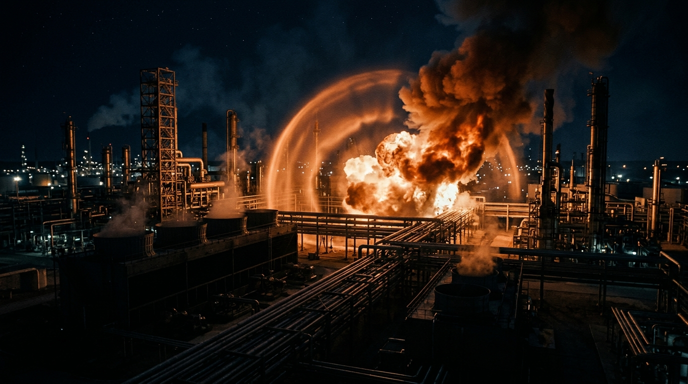
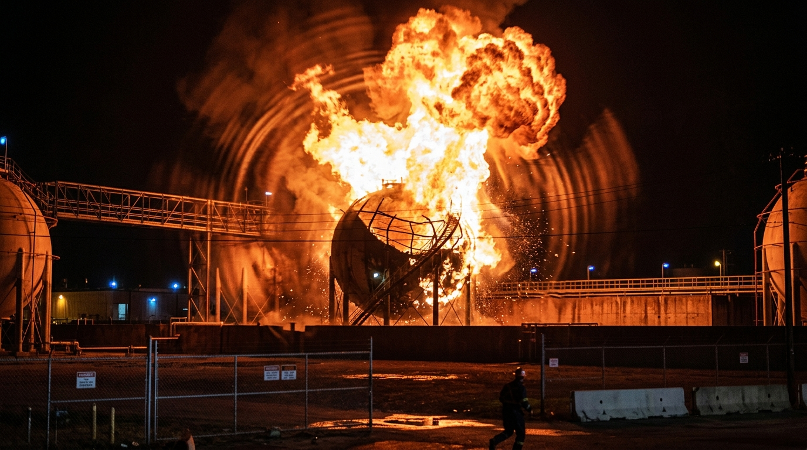
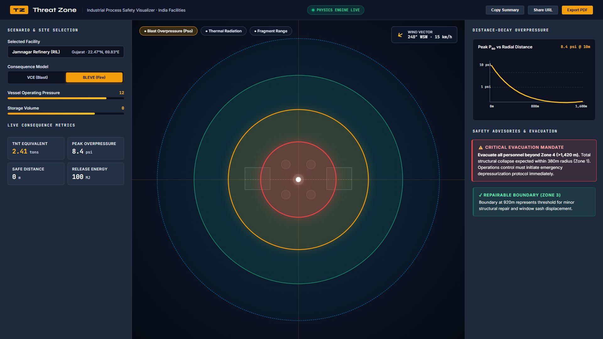
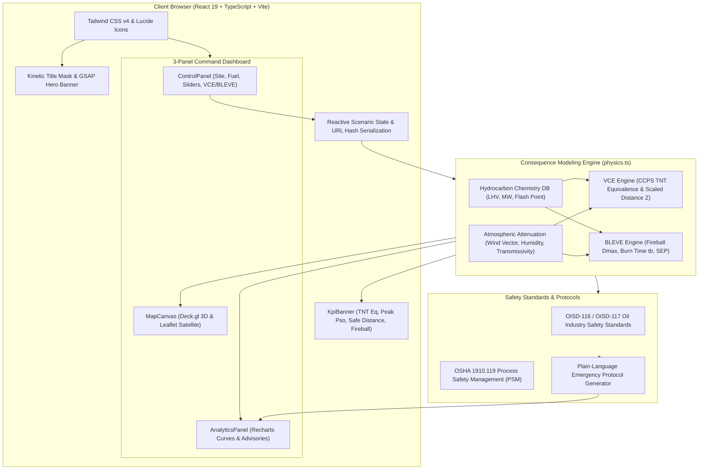

<div align="center">

# 💥 Threat Zone Enterprise
### **Real-Time Industrial Process Safety & Emergency Consequence Modeling Engine**

[](https://react.dev/)
[](https://www.typescriptlang.org/)
[](https://vitejs.dev/)
[](https://deck.gl/)
[](https://tailwindcss.com/)
[](https://greensock.com/gsap/)
[](./LICENSE)

<p align="center">
  <b>Mission-control consequence modeling for petrochemical installations.</b><br>
  High-precision VCE & BLEVE blast wave propagation, TNT equivalency, thermal radiation fluxes, and structural damage radii on real satellite maps with sub-second feedback.
</p>

[⚡ Quick Start](#-quick-start) • [📹 Video Showcase](#-video-showcase) • [📸 Interface Gallery](#-interface-gallery) • [✨ Key Features](#-key-features) • [🏛️ System Architecture](#-system-architecture) • [🔬 Physics Engine](#-consequence-physics-engine) • [🏭 Refinery Presets](#-indian-refinery-presets)

---

</div>

## 📹 Video Showcase

> Experience the speed, live GIS satellite telemetry, and real-time physics recalculation of **Threat Zone** in action.

<div align="center">

### 🎬 Launch Video Walkthrough

<video src="assets/threat-zone-demo.mp4" controls="controls" muted="muted" poster="assets/poster.jpg" width="100%" style="max-height: 600px; border-radius: 12px; box-shadow: 0 20px 40px rgba(0, 0, 0, 0.25);">
  <p>Your browser does not support HTML5 video. <a href="assets/threat-zone-demo.mp4"><b>Click here to view or download the demo video</b></a>.</p>
</video>

<br>

[](assets/threat-zone-demo.mp4)

<sub>👆 <i>Click the interactive preview above to stream or download full high-definition video with original sound design (<b>[assets/threat-zone-demo.mp4](assets/threat-zone-demo.mp4)</b>)</i></sub>

</div>

<br>

### ⏱️ Video Timeline & Operational Milestones

| Timestamp | Operational Phase | Telemetry & System Action |
|:---|:---|:---|
| **`0:00 - 0:04`** | **Kinetic Shockwave Hook** | Epicenter blast initiation, supersonic shockwave propagation, and fiery ember particle dynamics with cutout title lockup. |
| **`0:04 - 0:09`** | **Live Satellite Blast Radius** | GIS perspective shift to **Jamnagar Refining Complex (RIL)**; concentric 4-zone blast contour rendering (Zone 1 Fatal to Zone 4 Safe Boundary) with dynamic wind vector compass. |
| **`0:09 - 0:13`** | **Real-Time Physics Recalculation** | Interactive mode switch from **Vapor Cloud Explosion (VCE)** to **BLEVE Fireball**; sliders glide across fuel mass, operating pressure, and atmospheric factors with instantaneous KPI telemetry recalculation. |
| **`0:13 - 0:17`** | **Consequence Analytics & Advisory** | Real-time Peak Overpressure ($P_{so}$) distance-decay curve projection paired with automated **OISD / OSHA PSM emergency evacuation mandate** (`EVACUATE BEYOND ZONE 4`). |
| **`0:17 - 0:19`** | **Industrial Command Resolution** | Operational outro lockup: *"Model blast & fire risk at Indian refineries. Live. Accurate. Emergency-ready."* |

---

## 📸 Interface Gallery

<table width="100%">
  <tr>
    <td width="33%" align="center" valign="top">
      <b>Jamnagar GIS Blast Command</b>
      <br><br>
      
      <br>
      <sub><i>Real satellite canvas with concentric 4-zone hazard rings, facility epicenter & wind vector compass</i></sub>
    </td>
    <td width="33%" align="center" valign="top">
      <b>BLEVE Thermal Fireball Simulation</b>
      <br><br>
      
      <br>
      <sub><i>Vessel rupture dynamics, maximum fireball diameter ($D_{\text{max}}$), burn duration & thermal flux rings</i></sub>
    </td>
    <td width="33%" align="center" valign="top">
      <b>Analytics & Safety Advisories</b>
      <br><br>
      
      <br>
      <sub><i>Cartesian distance-decay overpressure curves, TNT equivalency & automated evacuation alerts</i></sub>
    </td>
  </tr>
</table>

---

## ✨ Key Features

### 1. 🎯 Concentric 4-Zone Hazard Classification
Threat Zone computes exact physical damage perimeters and maps them into clear operational cordons:
- 🔴 **Zone 1 (Severe / Fatal):** $>10.0\text{ psi}$ / $>37.5\text{ kW/m}^2$ — Complete structural demolition, heavy steel frame buckling, 100% lethality threshold for exposed personnel within seconds.
- 🟠 **Zone 2 (Heavy Damage):** $5.0\text{–}10.0\text{ psi}$ / $25.0\text{ kW/m}^2$ — Heavy process equipment displacement, partial roof collapse, second-degree burns to unprotected skin within 10–20 seconds.
- 🟢 **Zone 3 (Moderate / Repairable):** $1.0\text{–}5.0\text{ psi}$ / $12.5\text{ kW/m}^2$ — Non-structural wall displacement, minor process piping deformation, first-degree burn threshold; safe for personnel in protective turnout gear.
- 🔵 **Zone 4 (Safe Boundary):** $0.3\text{–}1.0\text{ psi}$ / $4.7\text{ kW/m}^2$ — Glass pane shatter threshold, emergency triage perimeter, public safe assembly line.

### 2. 💥 Dual Explosion Mechanics (VCE & BLEVE)
Seamlessly switch between two major industrial catastrophe mechanisms:
- **VCE (Vapor Cloud Explosion):** Models delayed ignition of unconfined hydrocarbon vapor clouds. Calculates effective explosive yield ($\eta$), TNT equivalent charge ($M_{\text{TNT}}$), and peak side-on overpressure ($P_{so}$).
- **BLEVE (Boiling Liquid Expanding Vapor Explosion):** Models sudden catastrophic failure of pressurized storage vessels. Calculates instantaneous liquid flash fraction, maximum fireball diameter ($D_{\text{max}}$), burn duration ($t_b$), atmospheric transmissivity ($\tau_{\text{atm}}$), and surface emissive power (SEP).

### 3. 🗺️ High-Resolution 2D & 3D GIS Satellite Canvas
- Real satellite imagery layers powered by **Deck.gl 9.4** and **Leaflet / React-Leaflet** with hardware-accelerated WebGL rendering.
- Accurate coordinates for plant units (FCCU, CDU/VDU, LPG Spheres, Naphtha Storage).
- Interactive epicenter reticle, distance measurement scales, smooth panning, and 3D terrain tilt.

### 4. 🧭 Atmospheric Dispersion & Meteorological Coupling
- Integrated meteorological controls: live wind azimuth direction ($^{\circ}\text{N}$), wind speed ($\text{km/h}$), ambient temperature ($^{\circ}\text{C}$), and relative humidity ($\%$).
- Downwind blast wave distortion and thermal radiation attenuation modeled via atmospheric transmissivity equations.
- Dynamic wind compass widget providing immediate visual orientation for emergency evacuation paths.

### 5. 📊 Real-Time Distance-Decay Analytical Curves
- Interactive Cartesian charts powered by **Recharts** plotting Peak Overpressure ($P_{so}\text{ in psi}$) and Thermal Flux ($E_{\text{rad}}\text{ in kW/m}^2$) against radial distance ($R\text{ in meters}$).
- Hover crosshairs and instant value inspection for any point of interest on the plant boundary.
- Comparative multi-fuel overlay: compare risk profiles of Propane, LPG, Methane, Ethylene, and Naphtha side-by-side.

### 6. 🏭 Pre-Configured Indian Petrochemical Presets
- Instant 1-click loading of India's major oil refineries and chemical hubs: Jamnagar (RIL), Koyali (IOCL), Mangalore (MRPL), Visakhapatnam (HPCL), Mumbai Mahul (BPCL/HPCL), Kochi (BPCL), and Panipat (IOCL).
- Pre-populated with verified GIS coordinates, typical vessel operating pressures, temperatures, and hydrocarbon inventories.

### 7. 📋 Automated Emergency Protocols & Safety Advisories
- Instant plain-language evacuation advisories aligned with **Oil Industry Safety Directorate (OISD)** standards (OISD-116/117) and **OSHA Process Safety Management (PSM)**.
- Specific operational instructions: primary perimeter cordons, firefighting foam deployment, water curtain cooling triggers, and hospital triage dispatch orders.

### 8. 🔗 Zero-Backend Instant Scenario Sharing
- Complete simulation states (facility, fuel type, pressure, temperature, fill volume, wind vector) serialized into standard URL hash strings (`Base64`).
- No external database or login required: instant collaboration and scenario distribution between HSE managers, ERT commanders, and safety trainees.

---

## 🏛️ System Architecture



---

## 📁 Repository Structure

```
Threat-Zone/
├── assets/                          # Showcase media, video and documentation assets
│   ├── threat-zone-demo.mp4         # 1080p full launch demo video (with audio)
│   ├── preview.gif                  # High-framerate animated preview GIF
│   ├── poster.jpg                   # Video poster thumbnail
│   ├── jamnagar-overview.jpg        # Satellite GIS blast command snapshot
│   ├── bleve-simulation.jpg         # BLEVE fireball & thermal radiation snapshot
│   └── hazard-advisory.png          # Real-time analytics & safety advisory snapshot
├── brag-output/                     # Video render pipeline & composition artifacts
├── public/                          # Static public web assets & refinery imagery
│   └── showcase/                    # High-resolution petrochemical facility photography
├── src/                             # Application source code
│   ├── components/                  # Modular React UI components
│   │   ├── dashboard/               # Control room command center layout
│   │   │   ├── AnalyticsPanel.tsx   # Overpressure decay curves & advisory feeds
│   │   │   ├── ControlPanel.tsx     # Facility selector, sliders & parameters
│   │   │   ├── DashboardShell.tsx   # Master 3-panel command dashboard grid
│   │   │   ├── ExportBar.tsx        # Zero-backend URL sharing & report export
│   │   │   ├── KpiBanner.tsx        # TNT equivalent, peak Pso & safe radius telemetry
│   │   │   └── ModelToggle.tsx      # Dual physics switcher [ VCE | BLEVE ]
│   │   ├── OnboardingWizard.tsx     # First-run safety engineer walkthrough
│   │   ├── RiskCharts.tsx           # Cartesian distance-decay curves (Recharts)
│   │   ├── RiskMap.tsx              # Leaflet 2D GIS satellite view with hazard rings
│   │   ├── RiskMap3D.tsx            # Deck.gl 3D geospatial canvas & layer controls
│   │   ├── Advisories.tsx           # OISD & OSHA emergency guidance cards
│   │   └── ThreatZoneHeroBanner.tsx # Kinetic title mask & telemetry hero
│   ├── constants/                   # Facility coordinates & petrochemical inventories
│   │   ├── data.ts                  # Hydrocarbon properties, heats of combustion & thresholds
│   │   └── regions.ts               # Indian refinery coordinates & installation metadata
│   ├── design/                      # Industrial design system tokens & stylesheets
│   │   ├── industrial-tokens.css    # Dark-mode control room color tokens
│   │   └── industrial-components.css# Panel chrome, tactile toggles & dials
│   ├── types/                       # Strict TypeScript type definitions
│   │   └── physics.ts               # Consequence modeling schemas & simulation interfaces
│   ├── utils/                       # Core mathematical & physics computational engines
│   │   ├── physics.ts               # CCPS VCE & BLEVE consequence calculation algorithms
│   │   ├── plainLanguage.ts         # Automated emergency advisory generation
│   │   ├── exportScenario.ts        # Base64 URL state encoder & JSON export
│   │   └── security.ts              # Input sanitization & boundary validation
│   ├── App.tsx                      # Root application layout & state orchestrator
│   └── main.tsx                     # React 19 entrypoint
├── package.json                     # Scripts and dependencies
├── vite.config.ts                   # Vite build configuration
└── tsconfig.json                    # Strict TypeScript compiler options
```

---

## ⚡ Quick Start

### Prerequisites
- **Node.js**: `v20.0.0` or higher (Tested on Node 20 & 24)
- **Package Manager**: `npm` or `pnpm`

### 1. Clone the Repository
```bash
git clone https://github.com/anshu706/Threat-Zone.git
cd Threat-Zone
```

### 2. Install Dependencies
```bash
npm install
```

### 3. Run the Development Server
```bash
npm run dev
```
> Open [http://localhost:5173](http://localhost:5173) in your browser to launch the Threat Zone command center.

### 4. Build for Production
```bash
npm run build
npm run preview
```

### 5. Security & Code Quality Checks
```bash
npm run security:check
```

---

## 🔬 Consequence Physics Engine

Threat Zone implements industry-standard consequence modeling methodologies based on the **Center for Chemical Process Safety (CCPS)** guidelines:

### 1. Vapor Cloud Explosion (VCE)
Computes equivalent TNT mass based on fuel mass, heat of combustion, and explosion efficiency factor ($\eta$):

$$M_{\text{TNT}} = \frac{\eta \cdot M_{\text{fuel}} \cdot \Delta H_c}{E_{\text{TNT}}}$$

*Where:*
- $\eta$ = Yield fraction ($3\%\text{--}10\%$ empirical cloud reactivity factor)
- $\Delta H_c$ = Lower heating value of hydrocarbon ($\text{MJ/kg}$)
- $E_{\text{TNT}}$ = Reference TNT blast energy ($4.68\times 10^6\text{ J/kg}$)

**Scaled Distance & Peak Side-On Overpressure ($P_{so}$):**
$$Z = \frac{R}{(M_{\text{TNT}})^{1/3}}$$

$$P_{so} = \frac{101.3}{Z} \left[ 1 + \left(\frac{Z}{0.28}\right)^{-2} + \left(\frac{Z}{0.85}\right)^{-1} \right] \quad (\text{kPa})$$

### 2. BLEVE Fireball & Thermal Radiation
When pressurized hydrocarbons undergo catastrophic vessel rupture, the resulting BLEVE fireball dimensions, duration, and thermal radiant flux are computed via empirical CCPS relations:

- **Maximum Fireball Diameter ($D_{\text{max}}$)**:
  $$D_{\text{max}} = 5.8 \cdot M_{\text{fuel}}^{1/3} \quad (\text{meters})$$

- **Burn Duration ($t_b$)**:
  $$t_b = 0.45 \cdot M_{\text{fuel}}^{1/3} \quad (\text{seconds})$$

- **Surface Emissive Power (SEP) & Received Thermal Flux ($E_{\text{rad}}$)**:
  $$E_{\text{rad}} = \tau_{\text{atm}} \cdot F_{\text{view}} \cdot \text{SEP} \quad (\text{kW/m}^2)$$

*Where $\tau_{\text{atm}}$ accounts for path-length atmospheric humidity absorption and $F_{\text{view}}$ is the geometric view factor.*

---

## 🏭 Indian Refinery Presets

Threat Zone comes pre-configured with exact GIS coordinates, typical vessel operational parameters, and storage inventories for India's premier refining installations:

| Facility Name | Operator | Coordinates | Primary Hydrocarbons |
|:---|:---|:---|:---|
| **Jamnagar Refining Complex** | Reliance Industries (RIL) | `22.4707°N, 69.8384°E` | Propylene, Ethylene, LPG, Reformate, Crude |
| **Vadodara Refinery (Koyali)** | Indian Oil Corp (IOCL) | `22.3686°N, 73.1232°E` | Naphtha, Butadiene, Propane, Crude |
| **Mangalore Refinery (MRPL)** | ONGC / MRPL | `12.9922°N, 74.8211°E` | Heavy Fuel Oil, LPG, Kerosene, Naphtha |
| **Visakhapatnam Refinery** | HPCL | `17.6974°N, 83.2564°E` | Motor Spirit, Diesel, High-Octane Blend |
| **Mumbai Refineries (Mahul)** | BPCL / HPCL | `19.0068°N, 72.8986°E` | Aviation Turbine Fuel, Hexane, LPG, Naphtha |
| **Kochi Refinery (Ambalamugal)**| BPCL | `9.9723°N, 76.3687°E` | Petrochemicals, Propylene derivatives, LPG |
| **Panipat Refinery & Petrochem** | Indian Oil Corp (IOCL) | `29.3909°N, 76.9635°E` | Polypropylene, MEG, Naphtha, PX/PTA |

---

## 🎨 Control Room Design System

Built on a bespoke dark mode aesthetic designed for control room clarity, zero visual fatigue during extended operations, and high contrast for critical alarms:

| Token | Hex Value | Application |
|:---|:---|:---|
| `--ids-bg-base` | `#0F172A` | Primary control room canvas |
| `--ids-bg-panel` | `#1E293B` | Structural chrome and instrumentation panels |
| `--ids-bg-elevated` | `#243044` | KPI cards and interactive parameter boxes |
| `--ids-accent` | `#F59E0B` | Industrial safety amber (active states & CTAs) |
| `--ids-zone-severe` | `#EF4444` | Zone 1 fatal overpressure / thermal threshold ($>10\text{ psi}$) |
| `--ids-zone-medium` | `#F59E0B` | Zone 2 structural failure threshold ($5\text{--}10\text{ psi}$) |
| `--ids-zone-low` | `#10B981` | Zone 3 minor damage perimeter ($1\text{--}5\text{ psi}$) |
| `--ids-zone-safe` | `#0284C7` | Zone 4 public evacuation line ($0.3\text{--}1\text{ psi}$) |

---

## 🛠️ Tech Stack

| Domain | Technology | Purpose |
|:---|:---|:---|
| **Frontend Core** | [React 19.2](https://react.dev/) | Concurrent UI architecture & state rendering |
| **Language** | [TypeScript 6.0](https://www.typescriptlang.org/) | End-to-end type safety & physics data contracts |
| **Build Tool** | [Vite 8.2](https://vitejs.dev/) | Sub-second HMR & optimized production bundling |
| **Geospatial & 3D** | [Deck.gl 9.4](https://deck.gl/) | WebGL-accelerated 3D consequence map layers |
| **GIS Mapping** | [Leaflet 1.9](https://leafletjs.com/) / [React-Leaflet 5](https://react-leaflet.js.org/) | Interactive 2D satellite tile layers & marker reticles |
| **Styling** | [Tailwind CSS v4.3](https://tailwindcss.com/) | Modern CSS engine with custom industrial design tokens |
| **Motion** | [GSAP 3.15](https://greensock.com/gsap/) / [@gsap/react](https://greensock.com/react/) | Deterministic shockwave animations & numeric counters |
| **Charts** | [Recharts 3.10](https://recharts.org/) | Cartesian distance-decay curves & comparative analytics |
| **Icons** | [Lucide React](https://lucide.dev/) | Industrial instrumentation icon system |
| **Linter & Security** | [Oxlint 1.75](https://oxc.rs/) | High-speed Rust-based linting & static analysis |

---

## 🛡️ Safety Disclaimer

> **IMPORTANT**: *Threat Zone is designed for incident pre-planning, consequence visualization, training, and educational safety awareness. It is not an automated replacement for formal site-specific Quantitative Risk Assessments (QRA), Process Hazard Analyses (PHA), or HAZOP studies conducted in accordance with statutory guidelines and regulatory bodies.*

---

## 📄 License

Distributed under the **MIT License**. See [LICENSE](LICENSE) for more information.

---

<div align="center">
  <sub>Threat Zone Enterprise © 2026. Built with precision for Indian industrial process safety and emergency consequence modeling.</sub>
</div>
